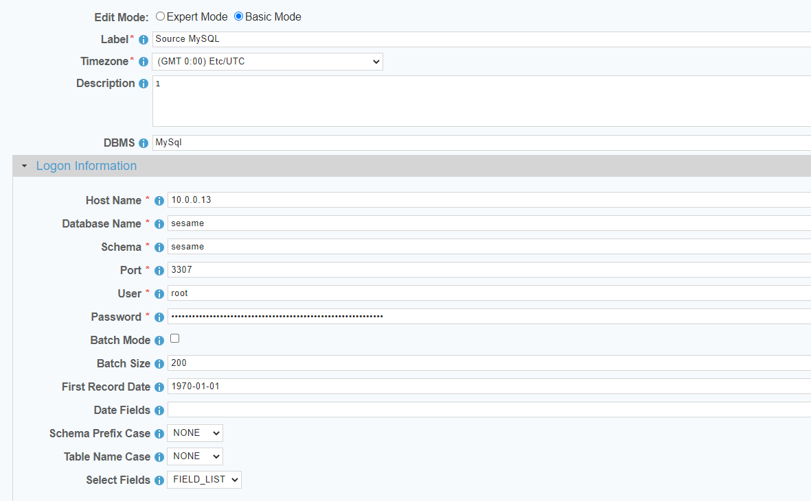

 <a href="http://www.sesamesoftware.com"></img></a>

# MySQL

[[Installation](../guides/installguide.md)] [[Registration](../guides/RegistrationGuide.md)] [[Configuration](../guides/configurationGuide.md)] [[Datasource](../guides/DatasourceGuide.md)]

---

### *Required Information*

* **Host**
* **User Name**
* **Password**
* **Schema**
* **Port**

### Steps

1. From the front page of the RJ UI, go to the left hand side and click **Datasources --> New Datasource**
2. On the next screen, choose a label for your Datasource.
   1. Recommended: ‘Source MySQL’ or something similar.
   2. Select MySQL Template
   3. Click Save
   
3. Logon Information Section
   1. Host: *ip or dns of database server*
   2. Database: *ServiceName*
   3. Schema: *Usually the same as database typically uppercase*
   4. Port: *default port for mysql is 3306*
   5. Username: *login name for database user*
   6. Password: *Password for database user*
   7. Tablespace: if applicable
      1. Data Tablespace
      2. Index Tablespace
      3. LOB Tablespace
4. If the Datasource is being use as a source:
      1. Date fields
         1. This is a comma separated list of fields that contain dates for use in incremental downloads.
         2. Choose any and all date fields in the Schema that are altered during a create or update of the records.
         3. The order of precedence is from left to right in what date field is chosen. Given a date field list `LastModifiedDate, CreatedDate` when the tables is queried it will check first if `LastModifiedDate` exists if it does, it will use that for incremental. If it doesn't then it will use `CreateDate`. If neither exist it will do a full table pull.
      2. First Record Date
         1. The oldest date found in the schema for the fields in the date field list. This helps to avoid slow startup of initial load where it will query empty time.
5. Click Test
6. Once you see Connection Test Successful, click Save and Close.

---

[[&#9664; Datasource Guide](../guides/DatasourceGuide.md)]

  <a href="http://www.sesamesoftware.com"></img></a> 

