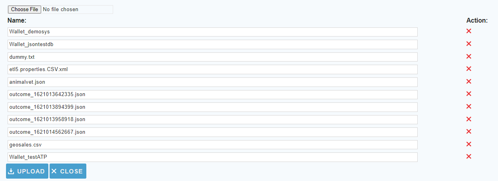

[comment]: # (Change Heading to reflect Datasource)

## Datasource Guide for Oracle Autonomous Data Warehouse

[comment]: # (Leave Nav BAR untouched)

---
[comment]: # (Leave Or Alter Required info as needed)

### *Required Information*

* **Wallet File**
* **Service Name**
* **User Name**
* **Password**
* **Schema**

### Steps

[comment]: # (step 1 is common to all Datasources)
[comment]: # (Step 2.1and 2.2 should be adjusted for Data Source specific)
[comment]: # (Step 3 should be Image of the datasource you can add the screenshot to the images folder or create a placeholder like {image of datasource screen})
[comment]: # (adjust step 4 and below as needed)

1. From the front page of the RJ UI, go to the left hand side and click **Datasources --> New Datasource**
2. On the next screen, choose a label for your Datasource.
   1. Recommended: ‘Source ADW’ or 'Target ADW' something similar.
   2. Select OracleADW Template
   3. Click Save
3. 
4. Logon Information Section
   1. DB Service Name: *should be db name _high, medium or low for example demosys_high this comes from the tns file in the wallet*
   2. Schema: *Usually the same as database Username typically uppercase*
   3. Username: *login name for database user*
   4. Password: *Password for database user*
   5. Wallet Location: *this would be the name of the wallet file without the .zip extension*
5. Click File Wizard at the bottom of the screen
6. 
   1. click choose file and navigate to you folder that contains  the wallet file
   2. click upload
   3. click close
7. Click Test
   1. if successful click save and close
   2. if not correct information
8. if Datasource is being use as a source

   1. Date fields
      1. This is a comma separated list of fields tht contain dates for use in incremental downloads
      2. Choose any and all date fields in the Schema that are altered during a create or update of the records
      3. The order of precedence is from left to right in what date field is chosen, given a date field list `LastModifiedDate, CreatedDate` when the tables is queried it will see first if `LastModifiedDate` exists if it does use that for incremental. If it doesn't then it will use `CreateDate` if neither exist it will do a full table pull.
   2. First Record Date
      1. the oldest date found in the schema for the fields in the date field list. This helps to avoid slow startup of initial load will it queries empty time.
9.  click Save and Close.

[Datasource Guide](../guides/DatasourceGuide.md)

