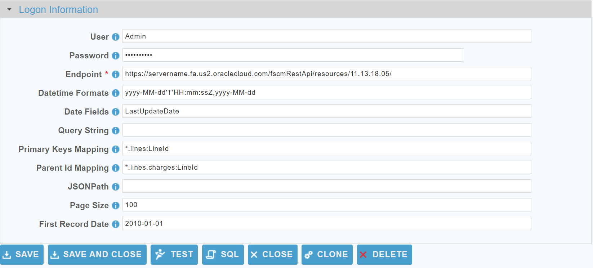

 <a href="http://www.sesamesoftware.com"></img></a>

# Oracle ERP

[comment]: # (Leave Nav BAR untouched)

[[Installation](../guides/installguide.md)] [[Registration](../guides/RegistrationGuide.md)] [[Configuration](../guides/configurationGuide.md)] [[Datasource](../guides/DatasourceGuide.md)]

---
[comment]: # (Leave Or Alter Required info as needed)

### *Required Information*

* **User**
* **Password**
* **Endpoint**

### Steps

[comment]: # (step 1 is common to all Datasources)
[comment]: # (Step 2.1and 2.2 should be adjusted for Data Source specific)
[comment]: # (Step 3 should be Image of the datasource you can add the screenshot to the images folder or create a placeholder like {image of datasource screen})
[comment]: # (adjust step 4 and below as needed)

1. From the front page of the RJ UI, go to the left hand side and click **Datasources --> New Datasource**

2. On the next screen, choose a label for your Datasource.
	1. Recommended: ‘Source Oracle ERP’ or something similar.
	2. Select OracleERP Template
	3. Click Save
   
3. 

4. Logon Information Section
	1. **User**: *Oracle ERP REST API User*
	2. **Password**: *Password for the given user*
	3. **Endpoint**: *Endpoint to the Oracle ERP REST API such as **https://[SERVER]/fscmRestApi/resources/11.13.18.05/** (please include the last forward slash)*
   
5. Click Test
	1. You see Connection Test Successful
   
6. Extended Properties
	1. **Datetime Formats**: Format of the datetime fields defined in the "Date Fields" property The standard Oracle ERP datetime formats are already pre-populated.
	2. **Date Fields**: The fields in the source objects that are date fields (comma delimited string). You can also use the star (\*) wildcard like such: LastModified\*
	3. **Query String**: Additional URL query parameters (must start with &). For Oracle ERP this is normally to expand the children like such:
		1. &expand=Employees,Employees.Managers
		2. &expand=all
	4. **Primary Keys Mapping**: How to identify the primary keys of the objects. Format is (note the comma delimiter): {objectName}:{fieldName},{objectName2}:{fieldName2}
		1. Examples (All Primary Key Mappings are Case Sensitive):
			1. With Wilcard: *.lines:LineId
			2. One to one: expenses:ExpenseId
	5. **Parent Id Mapping**: How to identify the Parent Id of an expanded child. \*NOTE that if the parent is already mapped in the Primary Keys Mapping this can be skipped.
		In the child object table the Parent Id will be mapped to a column named "PARENTID"
		1. Examples of getting the Invoice Lines children from the Invoice object and then mapping the Parent Id.
			1. **Query String**: &expand=invoices.invoiceLines
			2. **Parent Id Mapping**: invoices.invoiceLines:InvoiceId
	6. **JSONPath**: Path the JSON Array of records. Defaults to "items" as seen in this sample JSON. Most likely will not need to modify.
		
	7. **Page Size**: Number of records to return from each REST request (defaults to 100).
	8. **First Record Date**: When doing date range queries this tells the the Job all records are after this date.

7. Getting a Child Object Example

	Example JSON
	```JSON
	{
		"items": [
			{
				"HeaderId": 300000069352360,
				"OrderKey": "6232",
				...
				"lines": [
					{
						"HeaderId": 300000069352360,
						"LineId": 300000069352361,
	```

	When getting child objects you use the dot syntax (i.e. -get parent.child)
	For example, let's say we want the line items of the salesOrdersForOrderHub object (-get salesOrdersForOrderHub.lines)
	
	1. Expand the child lines by adding to the Query String like such:
		- &expand=lines

	2. Add the Primary Keys Mapping with format ***childObjectName:childObjectKey;parentKey***
	
	A semi-colon is used to delimit the child key and the parent key and also that the parent key is in the format ***parentName_keyFieldName***
		- salesOrdersForOrderHub.lines:LineId;salesOrdersForOrderHub_OrderKey

	3. Parent Id Mapping:
	
	Format is childObjectName:ParentKeyField;childKeyField
		- salesOrdersForOrderHub.lines:OrderKey;LineId

	4. Query Date Fields:
		- salesOrdersForOrderHub.lines=LastUpdateDate

8. Click Save and Close.

---

[[&#9664; Datasource Guide](../guides/DatasourceGuide.md)]

<p align="center" >  <a href="http://www.sesamesoftware.com"></img></a> </p>