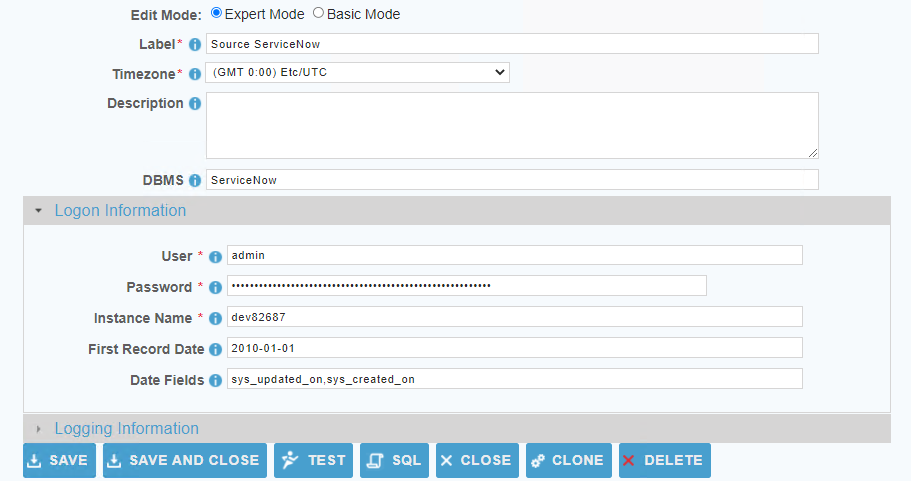

[comment]: # (Change Heading to reflect Datasource)

## Datasource Guide for ServiceNow

[comment]: # (Leave Nav BAR untouched)

---
[comment]: # (Leave Or Alter Required info as needed)

### *Required Information*

* **User**
* **Password**
* **Instance Name**
* **First Record Date**
* **Date Fields**

### Steps

[comment]: # (step 1 is common to all Datasources)
[comment]: # (Step 2.1and 2.2 should be adjusted for Data Source specific)
[comment]: # (Step 3 should be Image of the Datasource you can add the screenshot to the images folder or create a placeholder like {image of Datasource screen})
[comment]: # (adjust step 4 and below as needed)

1. From the front page of the RJ UI, go to the left hand side and click **Datasources --> New Datasource**
2. On the next screen, choose a label for your Datasource.
   1. Recommended: ‘Source ServiceNow’ or something similar.
   2. Select ServiceNow Template
   3. Click Save
 
3. Logon Information Section
   1. User: *ip or dns of database server*
   2. Password: *Password for database user*
   3. Instance Name: *Name of your instance, this is the first value presented in the URL. ex: mycompany from mycompany.servicenow.com*
   4. First Record Date: *This is the date of the first created record in your instance and takes the form YYYY-MM-DD.*
   5. Date Fields: *These are the date fields that will be used in order of priority for incrementalism. This is in the form of a lowercase comma separated list.*
4. Click Test
   1. If you see Connection Test Successful
      1. Click the SQL Button and perform a simple query to confirm that data is visible to the User. example `SELECT sys_created_on FROM system_dictionary`
      2. If no data is returned follow the instruction for a connection Test Failed below.
   2. If you see Connection Test Failed
      1. Check your User, Password, and Instance name and try again.
5. Click Save and Close.
6. When setting up the initial Warehouse configuration you will want to make sure that:
   1.  Interval Minutes under the Preferences Section is updated to 129600 (90 days in minutes) for the initial download.
   2. After the initial download is complete it can be changed to 14400 (10 days in minutes) for future runs. To set an expectation new tables added later may take up to 10 minutes for their first download.
