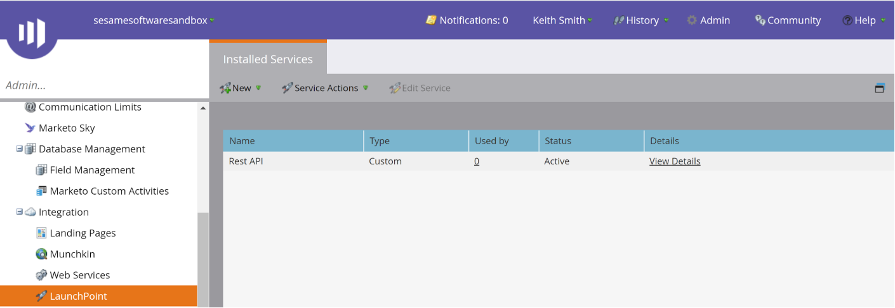

# Credentials for Marketo

---

## Grant Permissions

1. Navigate to **Admin&rarr;Security&rarr;Users & Roles**
2. Create a new role and grant permissions to the required APIs.

## Obtaining an API Token

1. Navigate to **Admin&rarr;Integration&rarr;Launch Point**

2. Click **View Details** and the following form displays

3. If you click **Get Token**, a new token will be generated.
Input the token into **OAuthAccessToken** property in the Open Authorization Information tab
After creating the access token, a connection can now be made using the values obtained from the previous steps. Specify these connection properties at a minimum to connect:

- **OAuthAccessToken** the Token Id when the access token was created.
- **OAuthClientId** the Consumer Key displayed when the application was created.
- **OAuthClientSecret** the Consumer Secret displayed when the application was created.

[[Previous](../marketo.md)]
