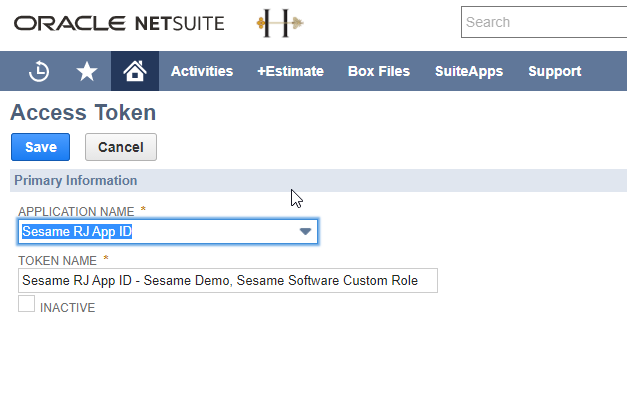

<a href="http://www.sesamesoftware.com"></img></a>

# Credentials for NetSuite

[[Installation](../installguide.md)] [[Registration](../RegistrationGuide.md)] [[Configuration](../configurationGuide.md)] [[Datasource](../DatasourceGuide.md)]

---
## Required Information for NetSuite Connection

* **Account ID**
* **Role ID**
* **Application ID**
* **Authorization Tokens**

1. Sign onto NetSuite using a Administrator login.
2. Navigate to **Setup&rarr;Company&rarr;Company Information**. 
   1. Find the `Account ID` and copy/paste to a .txt or other easy-to-find document.

2. Navigate to **Setup&rarr;Company&rarr;Enable Features&rarr;SuiteCloud&rarr;Manage Authentication**.
   1. Verify `Token-Based Authentication` and `TBA: Authorization Flow` are checked.
   2. Save.

3. Navigate to **Setup&rarr;Integration&rarr;Manage Integrations**.
   1. Click New.
   2. Name
      1. Suggested: `RJ App ID` or something similar.
   3. Concurrency Limit
      1. Based on how many concurrent connections instance can maintain.
      2. Default for Relational Junction is 1.
      3. Please contact [support](support@sesamesoftware.com) if attempting to set-up a multi-user job which may affect concurrence.
   4. Verify that `Token-Based Authentication` is checked.
   5. Checking `User Credentials` is optional.
   6. Un-check everything else.
   7. Save.
   8. On the next screen, the `Application ID`, `Consumer Key` and `Consumer Secret` will be displayed.
      1. The `Consumer Key` and `Consumer Secret` map directly to the `OAuthClientId` and `OAuthClientSecret` connection properties in RJWarehouse. 
   9. Save the `Application ID` and the keys to the document where you saved the `Account ID`.

4. Navigate to **Setup&rarr;User/Roles&rarr;Manage Roles**. 
   1. Create a new role or edit an existing role with the required configuration and permissions or RJWarehouse to use.
      1. See [Role Creation, Modification and Setting Permissions](../../images/netsuitepermissions.md) for more information on the requirements for roles and permissions.
   2. Locate the internal ID of the Role from the Manage Roles List display or the role itself.
   3. Add the Role ID to your document.

5. Navigate to **Setup&rarr;User/Roles&rarr;Manage Users**.
   1. Locate a User Login which the role you edited/created in Step 4 can be assigned to.
      1. This must be a login that can be accessed during this process.
   2. Click the Name of the user whom you are assigning the role.
   

   3. On the User screen, click Edit.
   4. On the User navigation bar click Access.
   5. Click the dropdown and select the role you edited/created in Step 4.
  

   6. Click Add.
   7. Click Save.
   
1. Log into the User whom you assigned the role you edited/created in Step 4.
   1. Verify that you are logged into that role.
      1. Check upper right hand corner, role will be listed.

   2. Scroll to the bottom of the home screen and click `Manage Access Tokens` in your Settings Portlet.

   3. Click `New My Access Token`
   4. In the Application Name dropdown, select the Application ID created in Step 3.
   5. Save.
   6. On the next screen, the `Token Id` and `Token Secret` will be displayed.
      1. The `Token Id` and `Token Secret` map directly to the `OAuthAccessToken` and `OAuthAccessTokenSecret` connection properties in RJWarehouse. 
   9. Save the keys to your document.

You should now have the following information in your txt document:

**AccountId** : Specifying the account to connect to.
**RoleId** : Specifying the role, and its permissions, to use.
**OAuthClientId** : The Consumer Key displayed when the Application ID was created.
**OAuthClientSecret** : The Consumer Secret displayed when the Application ID was created.
**OAuthAccessToken** : The Token Id displayed when the Role Access Token was created.
**OAuthAccessTokenSecret** : The Token Secret displayed when the Role Access Token was created.

It is recommended to preserve this txt file in a safe location.

---

[[&#9664; Back to NetSuite Datasource](../netsuite.md)]

  <a href="http://www.sesamesoftware.com"></img></a> 

