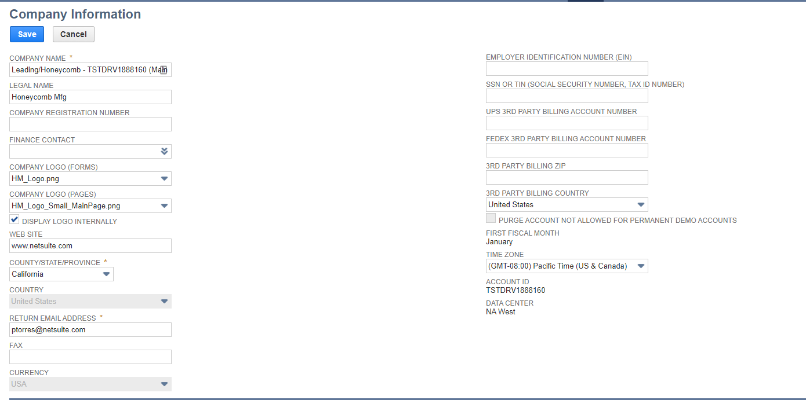
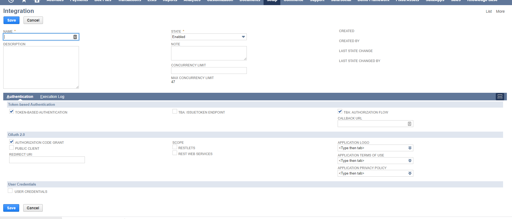
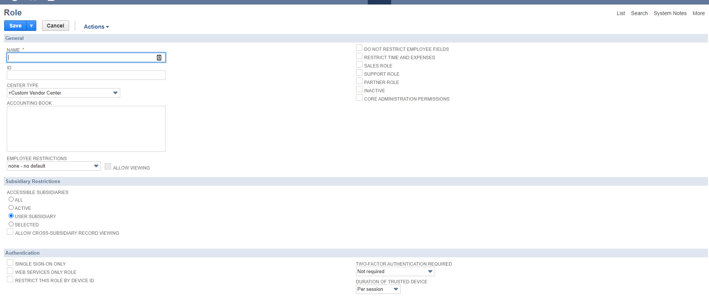

# Credentials for NetSuite

---

1. In NetSuite, log in as an administrator role and navigate to **Setup&rarr;Company&rarr;Company Information**. Save the Account ID to a document.

2. Navigate to **Setup&rarr;Company&rarr;Enable Features&rarr;SuiteCloud&rarr;Manage Authentication**.
3. Make sure Token-Based Authentication and TBA: Authorization Flow are checked and save changes.

4. Navigate to **Setup&rarr;Integration&rarr;Manage Integrations**.
5. Create a new integration and select Token-Based Authentication. When the integration is created, the Consumer Key and Consumer Secret displayed will map directly to the OAuthClientId and OAuthClientSecret connection properties in RJWarehouse. Save the Application ID and the keys to the document where you saved the Account ID.

6. Create a token role by navigating to **Setup&rarr;User/Roles&rarr;Manage Roles** and either create a new role or edit an existing role.
7. Under **Permissions&rarr;Setup**, the role must have the User Access Token: Full, Access Token Management: Full, and Web Services: Full permissions.
8. Add the role to a user under **Lists&rarr;Employees&rarr;Employees**. Select to edit an employee and add the new token role under **Access&rarr;Roles**.

9. Navigate to **Setup&rarr;User/Roles&rarr;Access Tokens** and create a new access token. Select the application name as the integration that was created earlier, and the same user and role that were updated in the previous steps.
10. After creating the access token, a Token Id and Token Secret will be displayed. These map directly to the OAuthAccessToken and OAuthAccessTokenSecret. Save these to the document.

After creating the access token, a connection can now be made using the values obtained from the previous steps. Specify these connection properties at a minimum to connect:

**AccountId** specifying the account to connect to.
**OAuthClientId** the Consumer Key displayed when the application was created.
**OAuthClientSecret** the Consumer Secret displayed when the application was created.
**OAuthAccessToken** the Token Id when the access token was created.
**OAuthAccessTokenSecret** the Token Secret when the access token was created.

[Previous](../netsuite.md)
