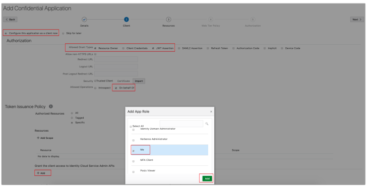
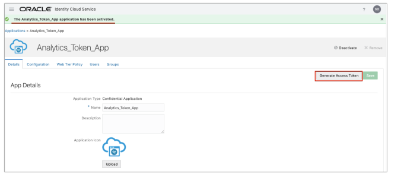
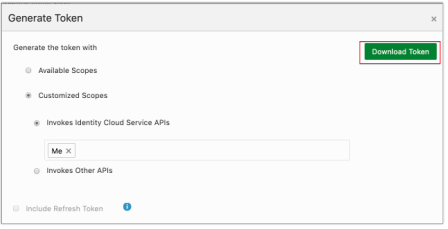

 <a href="http://www.sesamesoftware.com"></img></a>

# Getting IDCS Token

[[Installation](../installguide.md)] [[Registration](../RegistrationGuide.md)] [[Configuration](../configurationGuide.md)] [[Datasource](../DatasourceGuide.md)]

---

Get Login URL from **&#9776; &rarr; Identity & Security &rarr; Federation &rarr; OracleIdentityCloudService &rarr; Oracle Identity Cloud Service Console**

`https://<idcs-url>/ui/v1/adminconsole`

Navigate to "Applications" tab


 Click "Add" button and Choose "Confidential Application"


Enter a name e.g.: "Analytics_Token_App", Click Next


Click "Configure this application as a client

* Select allowed grant types:
  * Resource Owner
  * Client Credentials
  * JWT Assertion
* In "Allowed Operations", select
  * On behalf Of
* In "Grant the client access to Identity Cloud Service Admin APIs"
  * click "Add"
  * select "Me"



click add agin then next


click next


Click Finish


Copy and save the Client ID and Client SecretStep


Activate the applicationStep


Generate Access Token



Click on Download Token



A token file will be generated with name as “tokens.tok”

Extract Token from tokens.tok File

Open tokens.tok file. it will look something like

```json
{"access_token":"eyJ4NXQjUzI1NiI6Imt5bk1iQ ... ... ... 0jxcCw5oR0ajaNw"}
```

extract the value from the Key access_token. This is what you will need to create an OAC instance

---

[[&#9664; ORM Guide](../installwithORM.md)] 
[[&#9664; Terraform Guide](../installwithTerraform.md)]

<p align="center" >  <a href="http://www.sesamesoftware.com"></img></a> </p>