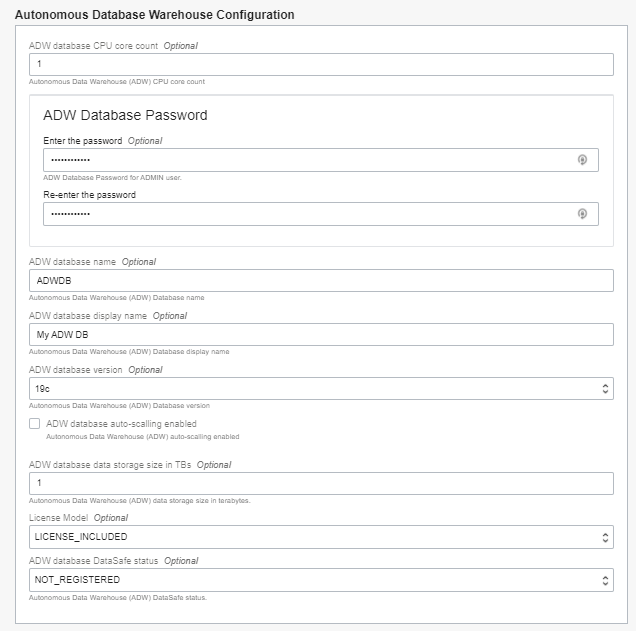

# Install with Oracle Resource Manager

---

## Getting Started

First step is to download The ORM compressed file [here](../release/RelationalJunctionOCIStack.zip)

### Creating the Stack

1. login to your oci tenancy
2. click &#9776; &rarr; Developer Services &rarr; Resource Manager &rarr; Stacks
3. 
   1. Set the compartment you whish to build in
   2. click Create Stack
4. 
   1. select My Configuration
   2. Select .zip File
   3. Browse to the download location of RelationalJunctionOCIStack.zip
   4. click ok
5. You can optionally change the name
6. change compartment to create the stack in
7. and add tags
8. clickNext

### Configuring the Stack Variables

#### The options

 Relational Junction Configuration

1. verify compartment
2. you can optionally set server name
3. select shape
   1. VM.Standard2.4 *default*
   2. VM.Standard2.8
   3. VM.Standard2.16
   4. VM.Standard2.24
4. you can choose License Type
   1. Relational Junction Standard *default*
   2. Relational Junction Enterprise
   3. Relational Junction BYOL
5. upload you public ssh key
6. you can create one following these [directions](Supporting/OCI-Prerequisites.md##setup-keys)
7. Chose Availability Domain. values are 1-3

Virtual Cloud Network Configuration Existing

1. Choose Compartment of existing VCN
2. Select VCN
3. Select Private and Public Subnets

Virtual Cloud Network Configuration New

Autonomous Database Warehouse Configuration

Autonomous Transaction Processing Configuration

Autonomous JSON Database Configuration

Database Systems Configuration

Object Storage Configuration

Oracle Analytics Cloud Configuration

### Reviewing

### upgrading to Latest version
